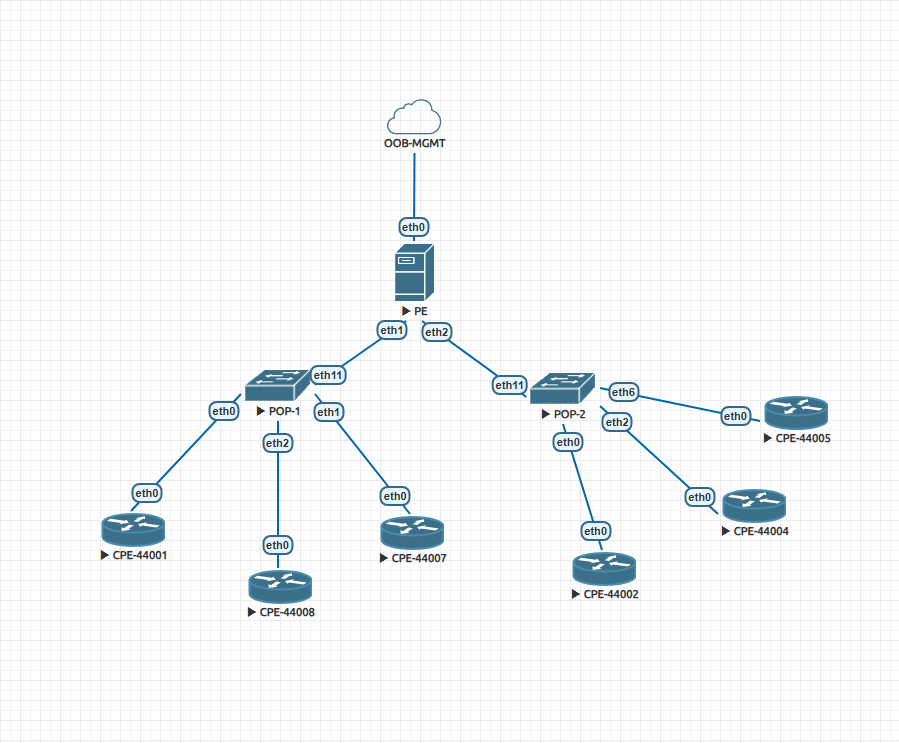
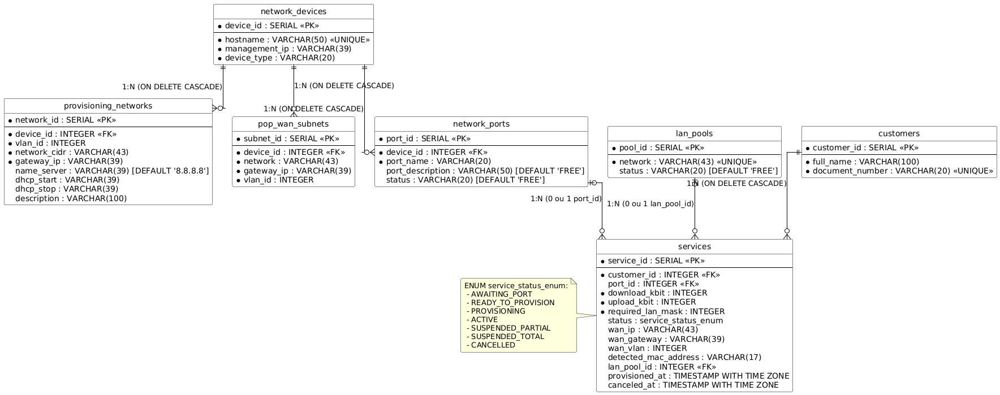
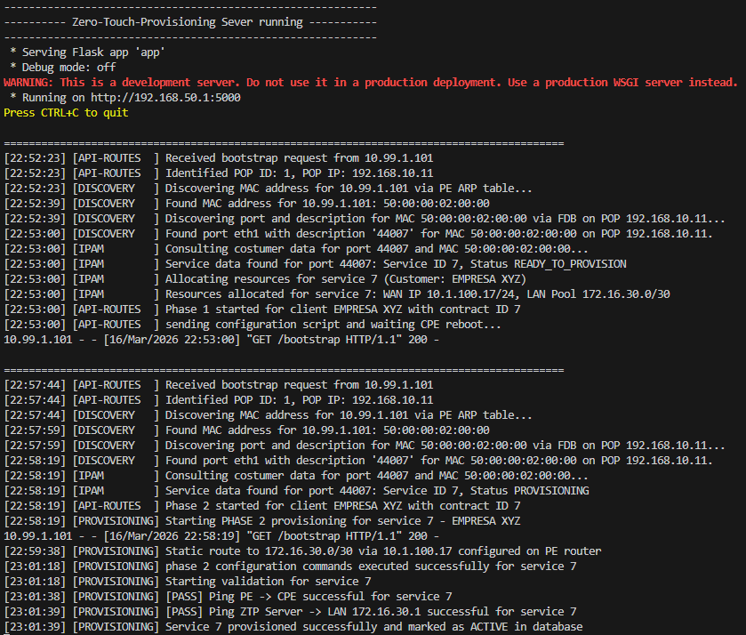

# Zero-Touch Provisioning (ZTP) Server

A robust, modular Python and Flask-based Zero-Touch Provisioning server designed for Internet Service Providers (ISPs) and enterprise network environments. This system fully automates the activation lifecycle of Customer Premises Equipment (CPE), handling Layer 2 physical discovery, automated IP address management (IPAM), configuration deployment, and post-provisioning validation.

Built with a Clean Code architecture and the Strategy design pattern, the core orchestration engine is vendor-agnostic, currently implementing full support for VyOS routers with a structure ready to scale to other vendors.

---

## Network Architecture & Topology

The application was designed and validated using a hierarchical ISP topology simulated in EVE-NG.



* **ZTP Server (OOB-MGMT):** The central orchestrator running this application. It requires Out-of-Band (OOB) or routed management access to the network infrastructure.
* **PE (Provider Edge):** The core router responsible for routing customer traffic. The ZTP server queries its ARP tables for L2 discovery and injects static routes dynamically.
* **POP (Point of Presence):** Layer 2/3 aggregation switches. The ZTP server queries the Forwarding Database (FDB) on these devices to trace a CPE's MAC address to a specific physical port.
* **CPE (Customer Premises Equipment):** The end-user routers acting as DHCP clients on their WAN interfaces to trigger the initial bootstrap process.

---

## Database Architecture (Source of Truth)

The system relies on a PostgreSQL database acting as the ultimate Source of Truth (SoT) for inventory, IPAM, and service states.



The schema is highly relational and normalizes network components:
* `network_devices`: Inventory of all PE and POP devices.
* `network_ports`: Maps physical interfaces on POP devices, acting as the anchor point for customer services.
* `provisioning_networks` & `pop_wan_subnets`: Defines the management/ZTP subnets and the actual production subnets for routing.
* `lan_pools`: Pre-defined customer LAN subnets waiting for allocation.
* `services`: The core table linking a customer, a physical port, bandwidth profiles (QoS), and the current provisioning state (e.g., `READY_TO_PROVISION`, `ACTIVE`).

---

## Core Workflow & Execution Logs

The ZTP process is divided into two distinct phases to ensure stability. Below is a breakdown of the workflow based on the server logs.



### Phase 1: Discovery, IPAM, and Bootstrap
When an unconfigured CPE connects to the network, it requests a temporary IP via DHCP and reaches out to the ZTP server.

1.  **Request Reception:** The server receives a bootstrap request and identifies the POP location based on the origin subnet.
2.  **Layer 2 Discovery:** * The server accesses the PE router via SSH to read the ARP table and resolve the CPE's temporary IP to its MAC address.
    * It then logs into the respective POP switch and performs an FDB (MAC address table) lookup to identify exactly which physical port the CPE is connected to.
3.  **Contract Resolution:** Using the port description, the server queries the database to find an associated pending service contract.
4.  **Resource Allocation (IPAM):** The system dynamically calculates the new production WAN IP and allocates a `/30` LAN subnet from the available pools.
5.  **Configuration Delivery:** A shell script is returned to the CPE. This script sanitizes factory defaults, applies the production WAN IP, commits the changes, and forces a system reboot.

### Phase 2: Orchestration and Validation
After the reboot, the CPE comes online with its permanent IP address and requests the bootstrap URL again.

1.  **State Detection:** The server queries the database, sees the state is `PROVISIONING`, and launches a background thread to handle SSH configuration without blocking the HTTP response.
2.  **Core Routing Injection:** The server accesses the PE router and injects a static route, pointing the customer's allocated LAN subnet to their new WAN IP.
3.  **CPE Configuration:** The server accesses the CPE via SSH and applies the final configurations, including LAN interfaces, bridging, and bandwidth limiters/shapers (QoS) based on the customer's contracted speeds.
4.  **Validation:** The server performs automated ping tests:
    * From the PE router to the CPE's LAN gateway to validate backbone routing.
    * From the ZTP server to the LAN gateway to validate global reachability.
5.  **Completion:** Upon successful validation, the service status is updated to `ACTIVE` in the database.

---

## Codebase Architecture

The repository is structured following Clean Code principles, ensuring scalability and maintainability.

* `app/routes/`: Flask blueprints handling HTTP endpoints. Contains no business logic.
* `app/services/`: Core orchestration logic (`workflow_service`), IPAM management (`ipam_service`), and L2 discovery mechanisms (`discovery_service`).
* `app/network/`: SSH connection wrappers using Netmiko.
* `app/network/vendors/`: Implementation of the Strategy pattern. Vendor-specific command generation (e.g., VyOS) is isolated here.
* `app/db/`: Repository pattern implementation abstracting psycopg2 interactions.

---

## Installation & Setup

### Prerequisites
* Python 3.9+
* PostgreSQL 14+
* EVE-NG instance (if reproducing the exact development environment).
* Network reachability to the management interfaces of your lab devices.

### EVE-NG Lab Reproduction (Optional)
To test the code in an exact replica of the development environment, an EVE-NG lab export is provided in this repository.

1. Locate the lab export `.zip` file in the `eve-ng/` directory.
2. Import the file into your EVE-NG web interface.
3. Ensure you have the corresponding VyOS router images installed in your EVE-NG node folder.
4. Start the nodes and verify that the `OOB-MGMT` cloud node is bridged correctly to allow your local machine (running the Flask server) to communicate with the `192.168.50.0/24` management subnet.

### Deployment

### 1. Clone the repository
```bash
git clone git@github.com:ojotaeme/Zero-Touch-Provisioning.git
cd Zero-Touch-Provisioning
```

### 2. Create and activate a virtual environment
```bash
python -m venv venv
source venv/bin/activate 
```

### 3. Install dependencies
```bash
pip install -r requirements.txt
```

### 4. Database Setup
Execute the scripts located in the database/ folder against your PostgreSQL instance to create the schema and seed the initial data.

### 5. Environment Configuration
Create a .env file in the root directory mirroring your lab setup:
```bash
FLASK_ENV=development
SERVER_IP=192.168.50.1

PE_MGMT_IP=192.168.50.10
DEVICE_USERNAME=vyos
DEVICE_PASSWORD=vyos
DEVICE_TYPE=vyos
DEVICE_PORT=22

DB_HOST=192.168.50.20
DB_NAME=autoprovisioning
DB_USER=admin
DB_PASSWORD=secret
DB_PORT=5432
```

### 6. Run the application
```bash
python run.py
```
